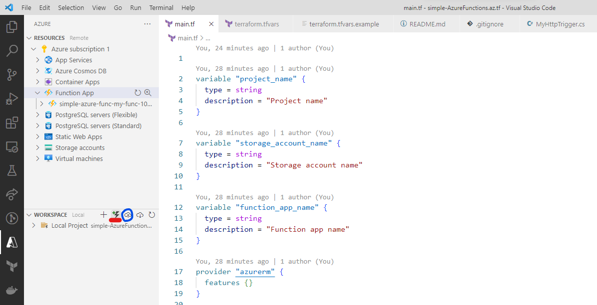

# simple-AzureFunctions.az.tf

🌿🌿🌿 Azure上にAzure Functionsを構築するためのTerraformのサンプルです。  

## 環境情報

| Name | Version |
| ---- | ---- |
| terraform | v1.3.7 |
| Azure CLI | 2.44.1 |

## 実行方法

`terraform.tfvars.example`をコピーして`terraform.tfvars`を作成し、適切な値を設定してください。  

```shell
terraform init
terraform plan
terraform apply
```

これで、関数アプリが作成されます。  
関数アプリとは関数のコンテナとしての役割を持ち、関数を実行するための環境を提供します。  

---

次は関数を作成します。  
ここでは`VS Code`を用いた方法を紹介します。  

`ms-vscode.vscode-node-azure-pack`という拡張機能をインストールします。  
左のサイドバーに`Azure`という項目が追加されていることを確認してください。  
これをクリックすると、Azureのサインイン画面が表示されるので、サインインしてください。  

  

サインイン後、`Azure`のサイドバーから雷(イナズマ)マークを`Create Function...`をクリックします。  
対象ディレクトリ、ランタイムの言語とバージョンを選択して、関数プロジェクトを作成します。  

デプロイするには雲と上矢印マークをクリックします。  
これで、Azure上に関数がデプロイされます。  

---

リソースを削除する場合は以下のコマンドを実行してください。  

```shell
terraform destroy
```

## 各種設定

### Terraform

[公式サイト](https://developer.hashicorp.com/terraform/downloads)にそって、Terraformをダウンロードしてください。  
インストール後は、以下のコマンドを実行して、Terraformのバージョンを確認してください。  

```shell
terraform version
```

正しくインストールされていない場合には、パスが通っていない可能性があります。  
パスが通っていない場合は、以下のコマンドを実行して、パスを通してください。  

```shell
# Windows
$env:PATH += ";C:/★パス★"

# Unix系
export PATH=$PATH:/★パス★
```

### Azure CLI

[公式サイト](https://learn.microsoft.com/ja-jp/cli/azure/install-azure-cli)にそって、Azure CLIをインストールしてください。  

インストール後は、以下のコマンドを実行して、Azureへログインしてください。  

```shell
az login
```

## 自分用メモ

### `VS Code`でのアカウントの切り替え

`F1`を押して、`Azure: Sign Out`を選択します。  
続けて、`Azure: Sign In`を選択します。  
これで、アカウントの切り替えができます。  

### エディタが警告を大量に出力する

一度コンパイルすると、直ります。  
